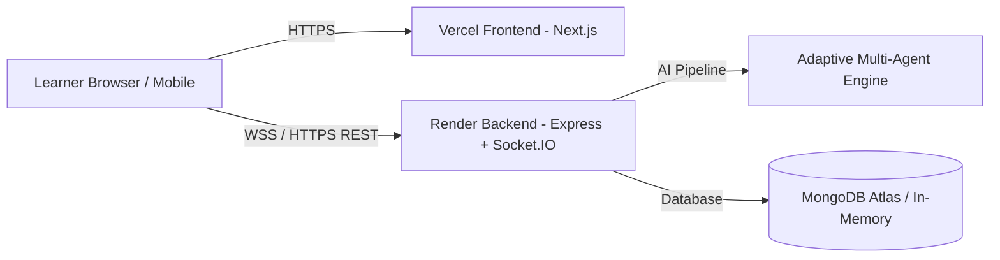

# 🚀 LingoVoice AI - Complete Deployment Guide (Vercel + Render + GitHub)

This guide walks you step-by-step through deploying **LingoVoice AI** to production:
- **Frontend**: [Vercel](https://vercel.com) (Next.js client)
- **Backend**: [Render](https://render.com) (Node.js Express + Socket.IO server)
- **Code Repository**: [GitHub](https://github.com)

---

## 📋 Architecture Overview



---

## 🛠️ Step 1: Push Code to GitHub

### 1.1 Initialize Git in the Project Root
Open your terminal in `c:\LingoVoiceAI` and run:

```bash
# Initialize local git repository
git init

# Stage all files (respecting .gitignore)
git add .

# Create your initial commit
git commit -m "feat: complete LingoVoice AI platform with light/dark theme and student accessibility"

# Rename branch to main
git branch -M main
```

### 1.2 Create a New Repository on GitHub
1. Go to [github.com/new](https://github.com/new).
2. Set **Repository name**: `lingovoice-ai` (or your preferred name).
3. Set visibility to **Public** or **Private**.
4. Do **NOT** check "Add a README file" or ".gitignore" (we already have them).
5. Click **Create repository**.

### 1.3 Link and Push to GitHub
Copy the remote URL from GitHub and run:

```bash
# Replace YOUR_USERNAME with your GitHub username
git remote add origin https://github.com/YOUR_USERNAME/lingovoice-ai.git

# Push the main branch
git push -u origin main
```

---

## 🖥️ Step 2: Deploy Backend to Render

### 2.1 Create a Web Service on Render
1. Go to [dashboard.render.com](https://dashboard.render.com) and log in.
2. Click **New +** in the top navigation and select **Web Service**.
3. Choose **Build and deploy from a Git repository**.
4. Select your `lingovoice-ai` repository (click "Connect").

### 2.2 Configure the Render Web Service
Fill in the deployment settings:

| Setting | Value |
| :--- | :--- |
| **Name** | `lingovoice-backend` (or `lingovoice-api`) |
| **Region** | Choose the closest region (e.g. *Oregon (US West)* or *Frankfurt*) |
| **Branch** | `main` |
| **Root Directory** | `server` ⚠️ *(Crucial!)* |
| **Runtime** | `Node` |
| **Build Command** | `npm install` |
| **Start Command** | `npm start` |
| **Instance Type** | `Free` |

### 2.3 Set Backend Environment Variables on Render
Scroll down to the **Environment Variables** section and add:

| Key | Value | Description |
| :--- | :--- | :--- |
| `PORT` | `5000` | Port for the Express server |
| `NODE_ENV` | `production` | Production mode |
| `CLIENT_URL` | `*` *(or your Vercel URL in Step 4)* | Allowed CORS origin |
| `JWT_SECRET` | `lingovoice_super_secret_jwt_key_2026_prod` | Secret key for auth tokens |
| `JWT_EXPIRES_IN` | `7d` | Token expiry duration |
| `MONGO_URI` | *(Your MongoDB Atlas URI or leave blank)* | Optional MongoDB connection string |
| `OPENROUTER_API_KEY` | *(Optional)* | Optional LLM API Key |
| `GEMINI_API_KEY` | *(Optional)* | Optional Gemini API Key |

> [!TIP]
> If `MONGO_URI` is left blank or disconnected, the backend server automatically runs its built-in in-memory database with zero setup required!

### 2.4 Deploy
1. Click **Deploy Web Service**.
2. Wait 2–3 minutes for the build to complete.
3. When live, copy your **Render URL** (e.g. `https://lingovoice-backend.onrender.com`).
4. Test the health check in your browser: `https://lingovoice-backend.onrender.com/api/health`.

---

## 🌐 Step 3: Deploy Frontend to Vercel

### 3.1 Create a Project on Vercel
1. Go to [vercel.com/new](https://vercel.com/new) and log in.
2. Under "Import Git Repository", find and select your `lingovoice-ai` repository.

### 3.2 Configure the Project Settings
1. **Project Name**: `lingovoice-ai`
2. **Framework Preset**: `Next.js`
3. **Root Directory**: Click **Edit** next to Root Directory and select `client` ⚠️ *(Crucial!)*.

### 3.3 Set Frontend Environment Variables on Vercel
Expand the **Environment Variables** section and add:

| Key | Value | Example |
| :--- | :--- | :--- |
| `NEXT_PUBLIC_API_URL` | `https://YOUR-RENDER-BACKEND.onrender.com/api` | `https://lingovoice-backend.onrender.com/api` |
| `NEXT_PUBLIC_SOCKET_URL` | `https://YOUR-RENDER-BACKEND.onrender.com` | `https://lingovoice-backend.onrender.com` |

> [!IMPORTANT]
> Make sure `NEXT_PUBLIC_API_URL` ends with `/api` and `NEXT_PUBLIC_SOCKET_URL` is the base URL without trailing slash.

### 3.4 Deploy
1. Click **Deploy**.
2. Vercel will build and optimize your static pages (~1-2 minutes).
3. Once completed, you will see a preview screen with your live production URL (e.g. `https://lingovoice-ai.vercel.app`).

---

## 🔄 Step 4: Final Linkage (CORS Update on Render)

1. Open your [Render Dashboard](https://dashboard.render.com).
2. Click on your `lingovoice-backend` service.
3. Go to **Environment** in the sidebar.
4. Update `CLIENT_URL` with your live Vercel URL (e.g. `https://lingovoice-ai.vercel.app`).
5. Click **Save Changes** (Render will automatically redeploy with the updated CORS policy).

---

## ✅ Step 5: End-to-End Verification Checklist

Once both services are deployed:

- [ ] **1. Backend Health Check**: Visit `https://your-backend.onrender.com/api/health` → Should return `{"status": "healthy"}`.
- [ ] **2. Frontend Landing Page**: Open `https://your-frontend.vercel.app` → Beautiful dark/light glassmorphic landing page loads smoothly.
- [ ] **3. Light / Dark Theme Toggle**: Click the ☀️ / 🌙 toggle in the top bar to verify instant theme switching.
- [ ] **4. One-Click Demo Login**: Click **Sign In** → **Instant One-Click Demo Login** → Redirects to Dashboard.
- [ ] **5. Voice Studio Session**: Go to **Voice Studio** (`/learn`) → Start a session → Test the microphone or prompt suggestions.
- [ ] **6. Scenarios & Practice**: Open **Scenarios** (`/scenarios`) and **Practice Hub** (`/practice`) to verify sound playback and pronunciation scoring.

---

## 🆘 Troubleshooting Common Issues

| Issue | Cause | Solution |
| :--- | :--- | :--- |
| **CORS Error in Browser Console** | `CLIENT_URL` on Render does not match your Vercel domain. | Set `CLIENT_URL` in Render to your Vercel URL (or `*`). |
| **404 on API requests** | `NEXT_PUBLIC_API_URL` is missing `/api` suffix. | Check Vercel environment variable `NEXT_PUBLIC_API_URL=https://your-render.onrender.com/api`. |
| **Socket Connection Failed** | `NEXT_PUBLIC_SOCKET_URL` has wrong protocol or trailing slash. | Use `https://your-render.onrender.com` without `/` at the end. |
| **Render Free Tier Spin-Down** | Free instances spin down after inactivity. | The first request after sleep takes 30-50s to wake up; subsequent requests are instant. |
